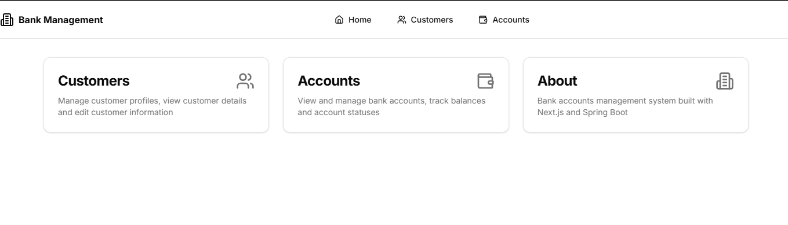

# Bank Accounts Management

A modern web application for managing bank accounts and customers built with Next.js and Spring Boot.

## Features

- 🏦 Complete bank account management system
  - Create and manage multiple bank accounts per customer
  - View account details including balance, type, and status
  - Track account history and transactions
  - Support for different account types (Savings, Checking, etc.)

- 👥 Customer profile management
  - Create and update customer profiles
  - View customer details and associated accounts
  - Search and filter customers
  - Manage customer status and preferences

- 💰 Account balance tracking

  - Real-time balance updates
  - Transaction history
  - Balance alerts and notifications
  - Currency support

- 📊 Clean and intuitive dashboard interface

  - Overview of key metrics and statistics
  - Quick access to frequently used features
  - Responsive design for all devices
  - User-friendly navigation

- 🔒 Account status management

  - Flexible status workflow (Created → Activated → Suspended → Blocked)
  - Status change audit trail
  - Automated status updates based on rules
  - Security controls based on status

- 💫 Modern, responsive UI with smooth animations

  - Polished user experience
  - Loading states and transitions
  - Mobile-first design approach
  - Accessibility features

- ⚡ Fast page loads with Next.js
  - Server-side rendering
  - Optimized asset loading
  - Route pre-fetching
  - Improved SEO

## Tech Stack

### Frontend

- Next.js 14 with App Router
- TypeScript
- Tailwind CSS for styling
- Lucide Icons
- Shadcn/UI components

### Backend

- Spring Boot
- Java
- RESTful API architecture

## Getting Started

1. Clone the repository
